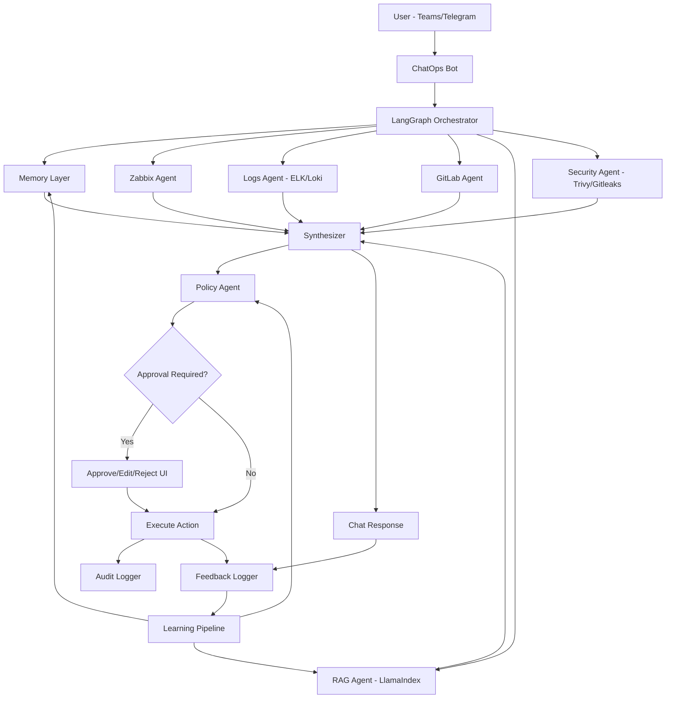

# Production-ready ChatOps AI Flow

## 1) High-level architecture

## 2) Core runtime sequence

1. **Input ingestion**: bot normalizes message metadata (`user_id`, `thread_id`, `channel`, `timestamp`).
2. **Routing**: intent + entities + environment are extracted.
3. **Memory load**:
   - Session memory for current thread.
   - Long-term preferences/policies for service/team.
4. **Parallel evidence collection** from tools (metrics, logs, deploy events, runbooks, security).
5. **Synthesis**:
   - Facts (observed evidence).
   - Inference (causal hypotheses with confidence).
   - Risk (impact and uncertainty).
   - Recommendation (safe next best action).
6. **Policy enforcement**:
   - hard gates (e.g., `prod rollback => approval`).
   - soft gates (e.g., require more evidence before destructive action).
7. **Action/response**:
   - If no approval required: execute and log.
   - Else: show approval card with editable plan.
8. **Feedback capture** and write to event stream.
9. **Daily/periodic learning loop** updates policy candidates, retrieval boosts, and prompt/routing rules.

## 3) Production control points

- **Deterministic policy layer** in front of action execution.
- **Human-in-the-loop** for high-risk operations.
- **Auditability**:
  - all evidence snapshots,
  - all model recommendations,
  - all final actions,
  - all human overrides.
- **Blast-radius controls**:
  - prefer canary rollback before full rollback,
  - enforce max action scope by environment.

## 4) Reliability/SRE requirements

- Timeouts + retries per tool adapter.
- Circuit breaker on unstable dependencies.
- Idempotency key for action execution.
- Dead-letter queue for failed asynchronous tasks.
- Full tracing (request_id propagated across all nodes).

## 5) Security requirements

- Action-level RBAC + environment scoping.
- Signed action requests with short TTL.
- Secrets only via vault; never persisted in prompts.
- PII/secret redaction before persistence and training datasets.

## 6) Data boundaries

- **Memory** stores short operational facts/preferences.
- **Knowledge (RAG)** stores curated docs/runbooks/postmortems.
- **Feedback** stores judgment signals (`approve/edit/reject`, rationale).
- **Training candidates** are generated from feedback; model weights are not directly updated online.

## 7) Suggested rollout plan

- **Phase 1**: read-only assistant (no auto-execute).
- **Phase 2**: assisted actions with mandatory approval.
- **Phase 3**: limited auto-actions for low-risk environments.
- **Phase 4**: continuous optimization with guardrails and weekly policy review.

